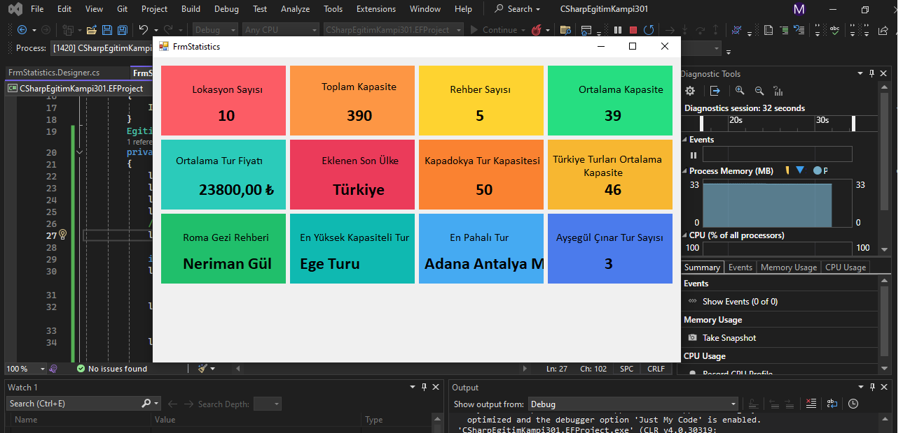

# EFProject

Bu proje, bir Windows Forms uygulamasında form yüklendiğinde (FrmStatistics_Load), Entity Framework kullanarak veritabanından çeşitli istatistiksel bilgileri çeker ve ilgili etiketlere (Label) yazdırır. Örneğin, toplam konum sayısını, kapasite ortalamasını, Türkiye’deki kapasite ortalamasını ve belirli rehberlerle veya şehirlerle ilgili verileri gösterir. Amaç, form üzerinde dinamik olarak istatistikleri görselleştirmektir.

